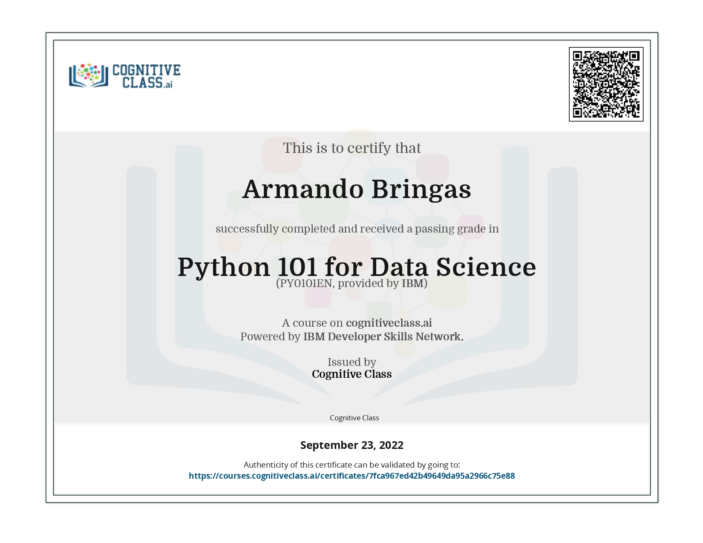
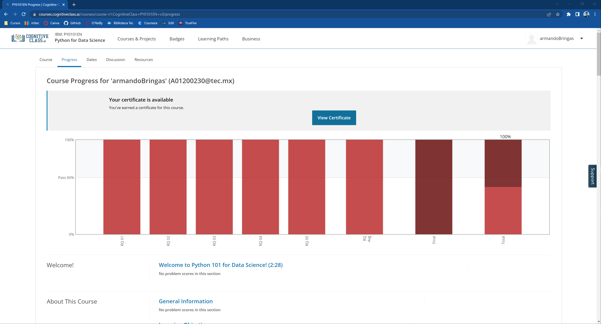

# Semana 2 - Actividad 1: Python for Data Science (IBM)

## Contenidos

* Notebooks
  * [IBM Notebooks](./1_IBM-Notebooks/)
  * [Apuntes propios del curso](./3_Notebooks_Evidencias_y_Apuntes/)
* Labs
  * [IBM Labs](./2_IBM-Labs/)
* Evidencias
  * [Apuntes propios del curso](./3_Notebooks_Evidencias_y_Apuntes/)
  * **[Certificado Obtenido del Curso](https://courses.cognitiveclass.ai/certificates/7fca967ed42b49649da95a2966c75e88)**
    \
    \
    

  * Captura de pantalla mostrando evidencia de los módulos concluidos
    \
    \
    
