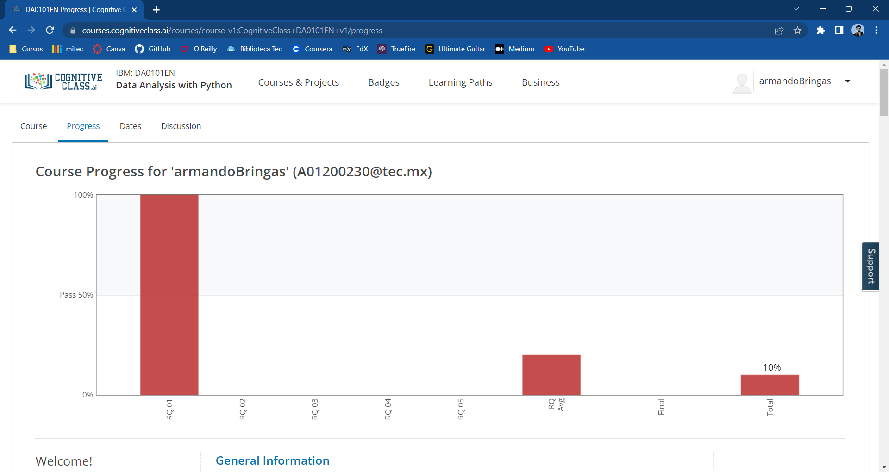

# Semana 2 - Actividad 1: Python for Data Science (IBM)

## Contenidos

* Notebooks
  * [Apuntes propios del curso](./2_Notebooks_Evidencias_y_Apuntes/)
* Labs
  * [IBM Labs](./1_IBM-Labs/)
* Evidencias
  * [Apuntes propios del curso](./2_Notebooks_Evidencias_y_Apuntes/)
  * [Evidencia del quiz](2_Notebooks_Evidencias_y_Apuntes\Graded_Questions-Module1.pdf)

Captura de pantalla mostrando evidencia de avance en el curso

