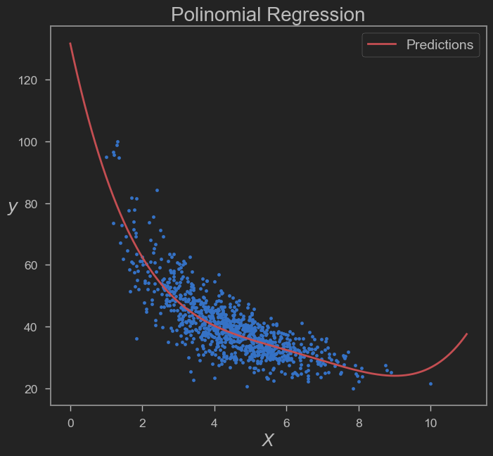
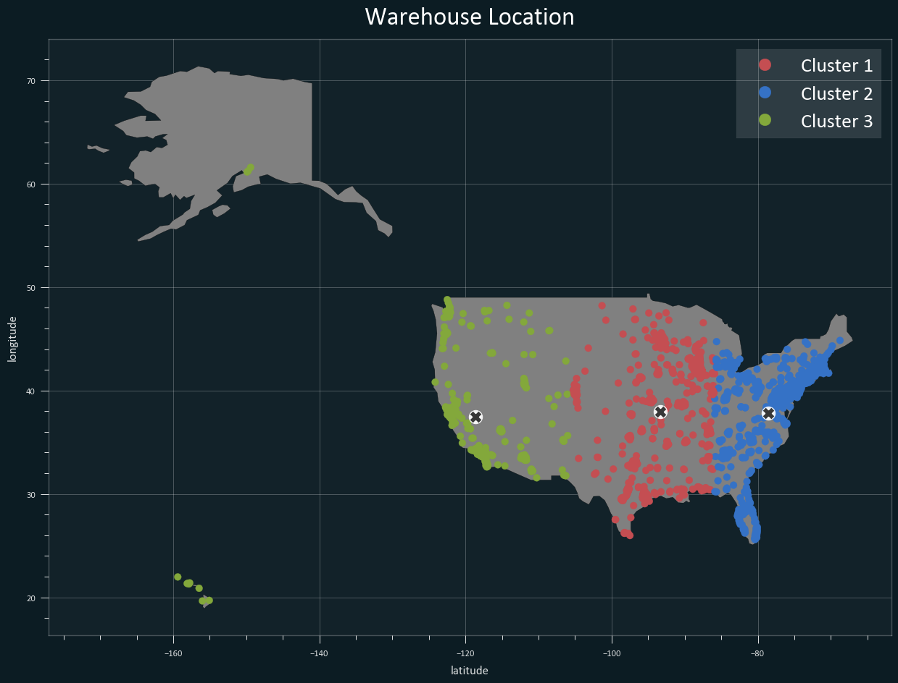

# Actividad Semanal -- 7 Regresiones y K-Means

Armando Bringas Corpus (A01200230)
> **_NOTA:_**  Recomendamos la visualización en HTML de los notebooks.

## Contenidos

* **Notebook 1 - Regresión**
  * [Jupyter Notebook (.ipnyb)](TecMty_kmeans_target.ipynb)
  * [HTML Notebook](https://htmlpreview.github.io/?https://github.com/PosgradoMNA/actividades-de-aprendizaje-armandoBringas-a01200230/blob/dev/Activity_week_8/Actividad-7-Regresiones_y_K-means/TecMty_Regresion_lineal_polinomial.html)
  * [PDF](TecMty_Regresion_lineal_polinomial.pdf)

  

* **Notebook 2 - K-means**
  * [Jupyter Notebook (.ipnyb)](TecMty_kmeans_target.ipynb)
  * [HTML Notebook](https://htmlpreview.github.io/?https://github.com/PosgradoMNA/actividades-de-aprendizaje-armandoBringas-a01200230/blob/dev/Activity_week_8/Actividad-7-Regresiones_y_K-means/TecMty_kmeans_target.html)
  * [PDF](TecMty_kmeans_target.pdf)

  
