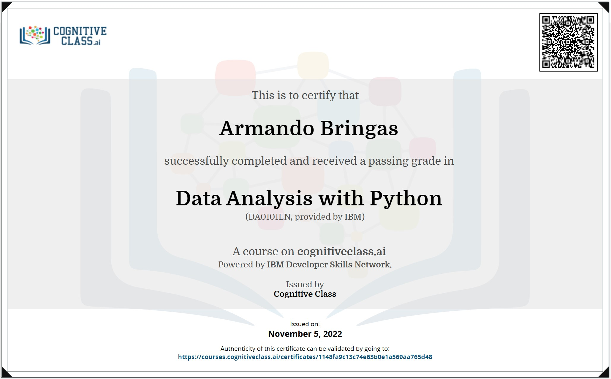

# Semana 8 - Actividad: Data Analysis with Python (IBM)

## Contenidos

* Notebooks
  * [Apuntes propios del curso](./2_Notebooks_Evidencias_y_Apuntes/)
* Labs
  * [IBM Labs](./1_IBM-Labs/)
* Evidencias
  * [Apuntes propios del curso](./2_Notebooks_Evidencias_y_Apuntes/)
  * [Evidencia del quiz](2_Notebooks_Evidencias_y_Apuntes/Graded_Questions-Module5.pdf)
  * [Certificación obtenida del Curso](2_Notebooks_Evidencias_y_Apuntes/IBM_DA0101EN_Certificate.pdf)

Captura de pantalla mostrando evidencia de obtención de certificado

